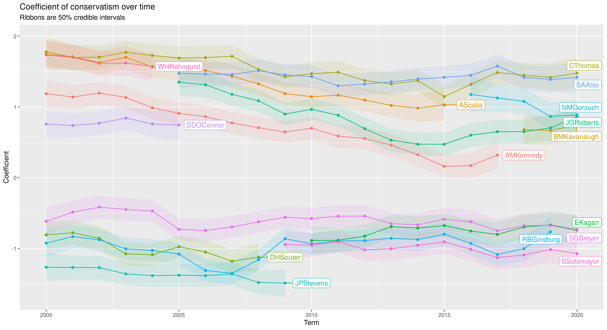

# Supreme Court model

Inspired by the Martin-Quinn model ([article][mq]), this model uses data from the
[Supreme Court Database][scd] to try to infer the political attitudes of SCOTUS
justices, and their trends over time.
To run the model, you will need the justice-centered data with cases organized
by citation.
You can download a compressed CSV with the data by following [this link][zip].
The model takes a few minutes to run if you restrict yourself to post-2000
data, which it will do unless you edit `sc.R`.
I recommend using a small fraction of the data for testing, since it can
take a while to run otherwise.

[I've written about this kind of model elsewhere.][me]
I think it leaves a lot of room for improvement.
Almost all models of Supreme Court behavior use very little information
about the justices and cases, and this one is no different.
The main improvement over the MQ model is that *this* model uses the variable
`lcDispositionDirection` from the Database.
Basically this variable tells whether the *lower court's* decision
had a "conservative" or "liberal" quality (or neither).
Since the convervative--liberal axis is reversible, you need some way
of deciding which end should be the "positive" one.
The original MQ model just used a strong prior for certain justices,
which I don't like.
(Maybe they stopped doing this.  I don't know.  The original article is pretty old.)
Instead, by adding `lcDispositionDirection` as a predictor, you can just
give it +1 for a conservative case and -1 for a liberal one.
How much you like this will depend on whether you trust the maintainers
of the Database.

[mq]:  https://www.researchgate.net/publication/2401108_Dynamic_Ideal_Point_Estimation_Via_Markov_Chain_Monte_Carlo_for_the_US_Supreme_Court_1953-1999
[scd]: http://scdb.wustl.edu/index.php
[zip]: http://scdb.wustl.edu/_brickFiles/2021_01/SCDB_2021_01_justiceCentered_Citation.csv.zip
[me]:  https://halfofknowing.com/scotus.html
